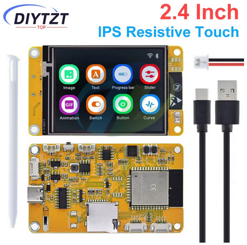
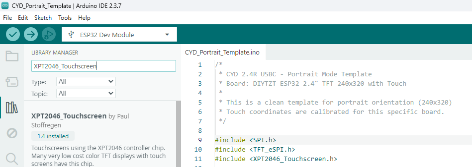
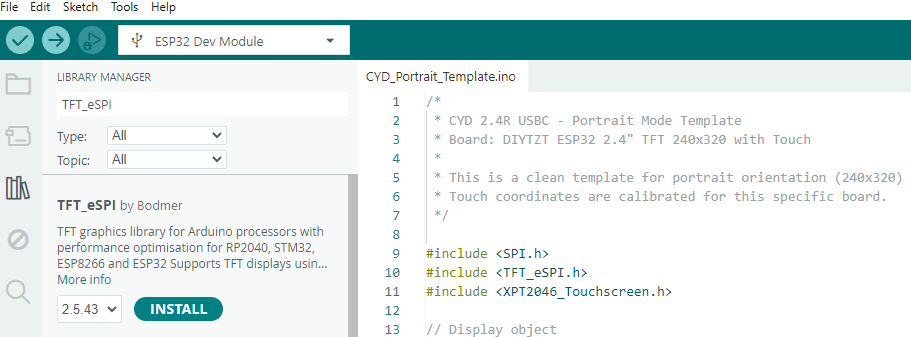
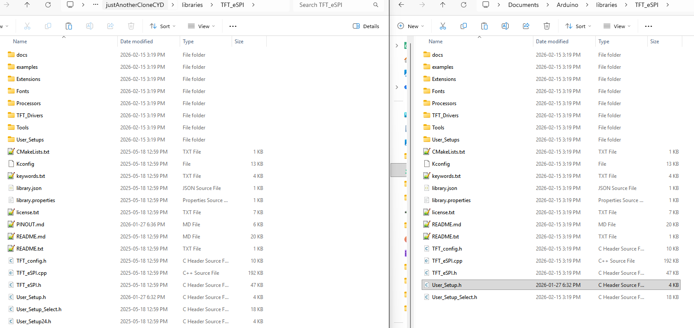
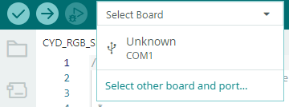
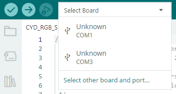
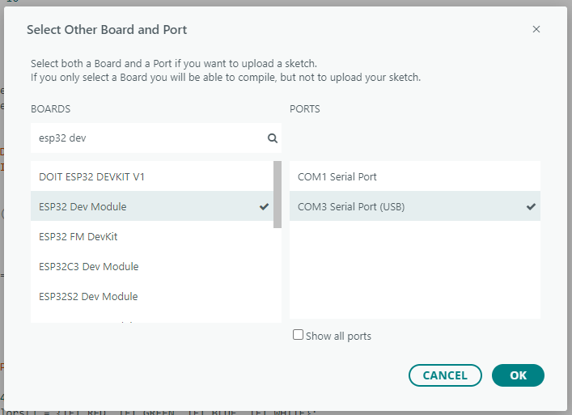
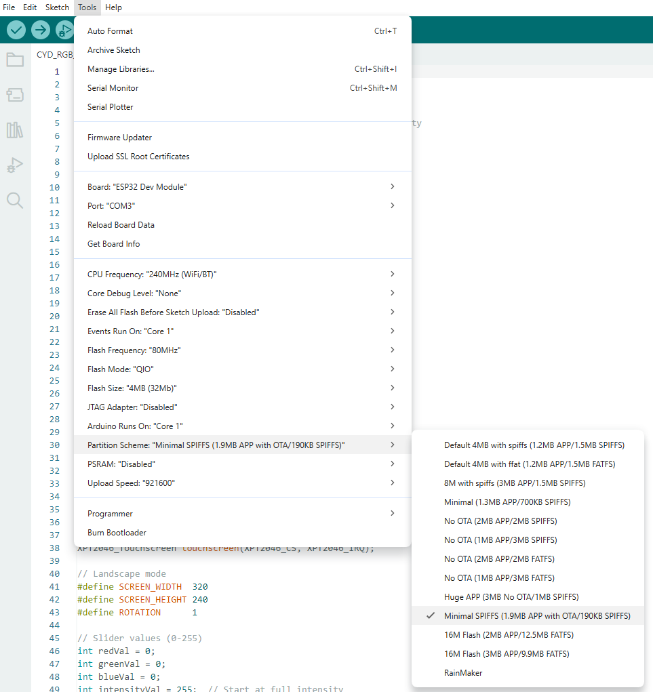
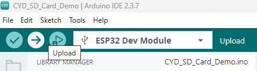

DISCLAIMER: This repo was developed using generative AI tools. Not the banter though.

# Just Another Clone CYD - 2.4" Resistive Variant (DIYTZT)

The brilliant [Witnessmenow](https://github.com/witnessmenow/ESP32-Cheap-Yellow-Display) has done dome great work documenting the 'official' CYD model(s), and the equally intelligent [Fr4nkFletcher](https://github.com/Fr4nkFletcher/ESP32-Marauder-Cheap-Yellow-Displayhttps:/) has developed projects for many other CYD variants. Inspired by their efforts, I have decided to document my projects and knowloedge here for beginners who are just getting started with ESP32 development. I've also included the original documentation from the OEM for reference.

**DIYTZT ESP32 LVGL WIFIBluetooth Development Board 2.4 inch LCD TFT Module 240*320 Smart Display Screen With Touch WROOM**

[AliExpress product link](https://www.aliexpress.com/item/1005008212152877.html?spm=a2g0o.order_list.order_list_main.11.23491802MXzmWg)




I purchased this board mostly because it seemed to be the cheapest one with USB C I could find.

## Getting Started

### Required Downloads

Download and install the [Arduino IDE from the Arduino website](https://docs.arduino.cc/software/ide/), then clone/download this repo to your C:\Users\\$USER\Documents\Arduino folder on your computer.

### Installing Required Libraries

1. Open the Arduino IDE and install the XPT2046_Touchscreen library

   
2. For the TFT_eSPI library, you can manually copy the /TFT_eSPI folder from the repo to your "C:\Users\\$USER\Documents\Arduino\libraries" or you can use Arduino IDE to download the latest version and just replace the user_setup.h file that is automatically downloaded with the one from this repo.

   

   


### Configuring your Arduino IDE

Open any of the .ino files contained in /exampleProjects. The first time you open a "sketch" (.ino file), you will need to select the board. Before you plug your board in, check to see what (if any) COM devices your PC detects.



Plug your board into your PC and validate that a new COM device appears. Select the new device and set it to be an ESP32 Dev Module.





To ensure maximum compatibility with a wide range of applications, I select a Minimal SPIFFs scheme to allow support for larger apps:




### Running Sketches

Once you have set up your libraries, selected your board, and selected your chosen scheme, you can deploy to your board. As of 02-15-26 you may get an error about bluetooth that won't stop compiling or  upload to board. 



```
C:\Users<user>\AppData\Local\Arduino15\packages\esp32\tools\esp32-libs\3.3.7\include\bt\include\esp32\include\esp_bt.h:16,
from C:\Users<user>\AppData\Local\Arduino15\packages\esp32\hardware\esp32\3.3.7\cores\esp32\esp32-hal-bt.c:30:
C:\Users<user>\AppData\Local\Arduino15\packages\esp32\tools\esp32-libs\3.3.7\include\controller\esp32\esp_bredr_cfg.h:18:9: note: '#pragma message: BT: forcing BR/EDR max sync conn eff to 1 (Bluedroid HFP requires SCO/eSCO)'
18 | #pragma message ("BT: forcing BR/EDR max sync conn eff to 1 (Bluedroid HFP requires SCO/eSCO)")
| ^~~~~~~
In file included from C:\Users<user>\AppData\Local\Arduino15\packages\esp32\tools\esp32-libs\3.3.7\include\bt\include\esp32\include\esp_bt.h:16,
from C:\Users<user>\AppData\Local\Arduino15\packages\esp32\hardware\esp32\3.3.7\cores\esp32\esp32-hal-misc.c:29:
C:\Users<user>\AppData\Local\Arduino15\packages\esp32\tools\esp32-libs\3.3.7\include\controller\esp32\esp_bredr_cfg.h:18:9: note: '#pragma message: BT: forcing BR/EDR max sync conn eff to 1 (Bluedroid HFP requires SCO/eSCO)'
18 | #pragma message ("BT: forcing BR/EDR max sync conn eff to 1 (Bluedroid HFP requires SCO/eSCO)")
| ^~~~~~~
```
